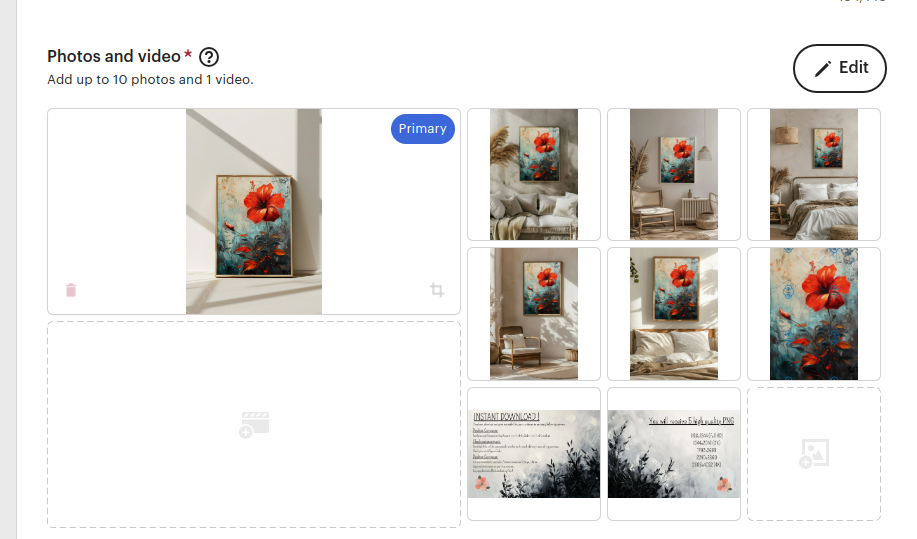
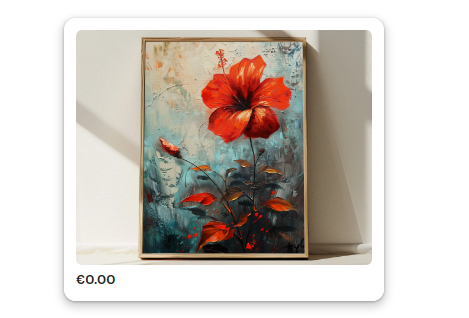

# palette-paradise

## To Koni, in french

1. **Accède au workspace**
    - Assures-toi d'être situé la où tu as la meilleure connexion possible.
    - Dans ton répertoire personnel, ouvre le dossier nommé `palette-paradise`.
    - Ouvre un terminal avec `Cmd+Space`.
    - Éxécute `cd ~/palette-paradise`.
    - Éxécute `git pull`.

2. **Crée les mockups avec Gimp (x fois le nombre de art que tu veux trâiter)**
    - Drag and drop le mockup `a.png` (situé dans `empty-mockups`) dans Gimp.
    - Drag and drop l'art qui se situe dans `raw` dans les calques en bas à droite (assures-toi que l'art est en dessous du mockup). Comme example on va prendre `000.png`.
    - `Clic droit` sur l'art -> `Scale layer` -> Width: 1100 -> `Scale`.
    - Avec l'outil `move tool` déplacer l'art pour qu'elle soit centrée.
    - Clic sur `File` -> `Export as...` -> exporter dans le dossier dans `filled-mockups` qui a le nombre de l'art comme nom (dans notre example: `000`), et appelle le `a.png` (comme le nom du mockup de base).
    - Fait de même pour les autres mockups (de `a.png` à `f.png`), voici les dimensions que tu dois mettre lorsque tu fais `Clic droit` sur l'art importé -> `Scale layer` comme précédemment:
    - `a.png`: Width: 1100
    - `b.png`: Width: 650
    - `c.png`: Width: 1000
    - `d.png`: Width: 800
    - `e.png`: Width: 820
    - `f.png`: Width: 900
    - Réitère pour chaque art.

3. **Applique le watermark**
    - Éxécute ceci: `python3 watermark.py`.

4. **Crée les fichiers finaux pour les clients**
    - Éxécute ceci: `python3 scaler.py`.

5. **Met à jour le repository GitHub**
    - Depuis ton terminal éxécute `git add .`, puis `git commit -m "wip: arts"`, puis `git push`.

6. **Donne accès aux fichiers finaux avec Google Drive**
    - Ouvre ton navigateur et va [ici](https://drive.google.com/drive/folders/1oDoOEjw5nxofDgovINPy6_TfF2lNLuYr).
    - Va dans `packed` et supprime tout.
    - Drag and drop tous les dossiers qui sont présents dans `packed` dans ton ordi, dans `packed` sur Google Drive.
    - Va [ici](https://script.google.com/home/projects/1V3AETZRo3WM-g3F79eNMSf9k1WG_soUgJGKfwsrwqrlam10kmaV3yuHD/edit) et clique sur le bouton `Run` en haut, puis attends que `Execution completed` soit affiché en bas.

7. **Publie en tant que draft sur Etsy (x fois le nombre de art que tu veux trâiter)**
    - Connecte-toi à [Etsy](https://www.etsy.com)
    - Navigue vers ton gestionnaire de boutique
    - Va dans la section `Listings`
    - Clique sur `Add a listing`
    - Sélectionne `Digital files`
    - `I did`
    - `A finished product`
    - `2020 - 2024`
    - Copie le titre depuis [ici](https://docs.google.com/spreadsheets/d/19dRz6FGXgXrKYPCkff_JlIWvXSlYTGwhcw0zfCBOgq4/edit#gid=0)
    - Ajoute tous les mockups du produit qui sont dans `filled-mockups` puis `000` (toujours le même example), il y a donc normalement 6 fichiers: `a.png`, `b.png`, `c.png`, `d.png`, `e.png` et `f.png`.
    - Ajoute aussi `ratios.png` et `support.png`, tous 2 situés dans `assets`.
    - Ajoute aussi `000.png`, situé dans `watermarked`, comme ceci:
    
    - L'ordre: 1er, le mockup avec _le plus grand cadre_ -> _tous les autres mockups_ -> _les ratios_ -> _le support_ puis le _watermarked_.
    - Centre la miniature en l'ajustant, comme ceci:
    
    - Copie aussi la description depuis [ici](https://docs.google.com/spreadsheets/d/19dRz6FGXgXrKYPCkff_JlIWvXSlYTGwhcw0zfCBOgq4/edit#gid=0)
    - Prix: 10
    - Quantité: 100
    - Catégorie: Impressions numériques
    - Choisis les 2 couleurs en fonction de la peinture
    - Largeur: 60
    - Hauteur: 90
    - Les deux en centimètres
    - Orientation: Verticale
    - Tags: oil, painting, vintage, flower, bloom, art, digital, print, {la couleur de la fleur}, nature, old, wall, home
    - Matériaux: digital
    - Section: Blooming Flower Portrait
    - Clique sur `Save as draft`
    - Réitère pour chaque art

8. **Note quelque part le numéro du dernier art que tu as traîté, afin de t'y retrouver la fois d'après**

Note: contacte-moi si tu as quelconque questionnement ou problème 🖖🖖🖖
