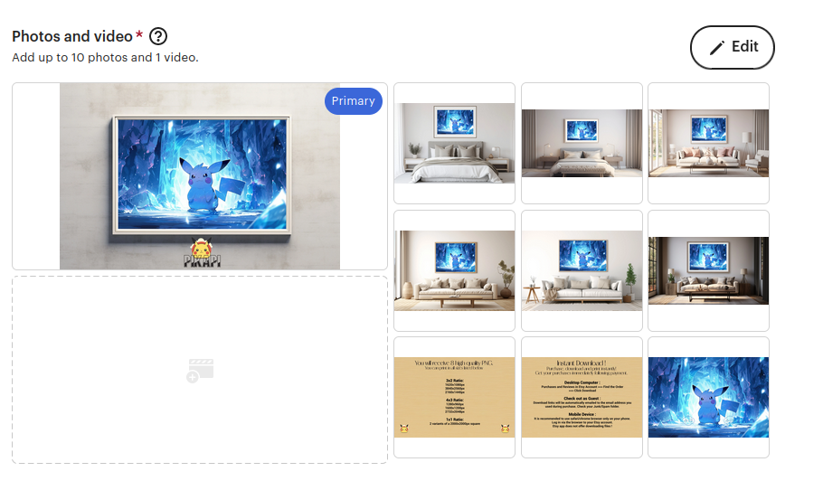

# palette-paradise

## To Koni

1. Open a terminal with `Ctrl+Alt+T`.
2. Run this: `cd ~`.
3. Run this: `git clone https://github.com/kitsuiwebster/palette-paradise`.
4. In your home directory, open the folder named `palette-paradise`, inside:
    - raw: the original paintings you have to put inside mockups
    - mockups: the mockup you have to use
    - assets: there is `watermark.png`, the `ratios.png` and the `support.png` inside
5. Create the mockups and the apply the watermark:
    - Export a version of each mockup for each raw
    - Exporit a version with the watermark applied for each raw
6. Open your browser and go [here](https://drive.google.com/drive/folders/18nrQZKyAkVvntWXsReFR0AjZcIIRd9ZK).
7. Drag and drop all your exports.
8. Publish as a draft:
    - Log-in to [Etsy](https://www.etsy.com)
    - Navigate to your shop manager
    - Go on the `Listings` section
    - Click on `Add a listing`
    - Select `Digital files`
    - `I did`
    - `A finished product`
    - `Made To Order`
    - Copy the title from [here](https://docs.google.com/spreadsheets/d/19dRz6FGXgXrKYPCkff_JlIWvXSlYTGwhcw0zfCBOgq4/edit#gid=0)
    - Add all mockups of the product
    - Also add the `watermark.png`, the `ratios.png` and the `support.png`
    Like this:
    
    - The order: 1st, the mockup with largest painting, all other mockups, the ratios, the support and the watermark
    - Copy the description also from [here](https://docs.google.com/spreadsheets/d/19dRz6FGXgXrKYPCkff_JlIWvXSlYTGwhcw0zfCBOgq4/edit#gid=0)
    - Price: 10
    - Quantity: 100
    - Category: Digital prints
    - Choose the 2 colors in function of the painting
    - Width: 90
    - Height: 60
    - Both in centimeters
    - Orientation: Vertical
    - Tags: oil, painting, vintage, flower, blooming, art, digital, print, {the_colo_of_the_flower}, nature, old, wall, home
    - Materials: digital
    - Click on `Save as draft`

## To Kitsui

Run `index.bash`.

It:

- Runs the `rename_raws.py` script
- Runs the `crop.py` script
- Stages, commit and pushes the local repo

## To Koni, in french

1. Ouvre un terminal avec `Ctrl+Alt+T`.
2. Exécute ceci : `cd ~`.
3. Exécute ceci : `git clone https://github.com/kitsuiwebster/palette-paradise`.
4. Dans ton répertoire personnel, ouvre le dossier nommé `palette-paradise`, à l'intérieur :
    - raw : les peintures originales que tu dois mettre à l'intérieur des maquettes
    - mockups : la maquette que tu dois utiliser
    - assets : il y a `watermark.png`, `ratios.png` et `support.png` à l'intérieur
5. Crée les maquettes et applique le watermark :
    - Exporte une version de chaque mockup pour chaque original
    - Exporte une version avec le watermark appliqué pour chaque original
6. Ouvre ton navigateur et va [ici](https://drive.google.com/drive/folders/18nrQZKyAkVvntWXsReFR0AjZcIIRd9ZK).
7. Glisse et dépose toutes tes exportations.
8. Publie en tant que brouillon :
    - Connecte-toi à [Etsy](https://www.etsy.com)
    - Navigue vers ton gestionnaire de boutique
    - Va dans la section `Listings`
    - Clique sur `Add a listing`
    - Sélectionne `Digital files`
    - `I did`
    - `A finished product`
    - `Made To Order`
    - Copie le titre depuis [ici](https://docs.google.com/spreadsheets/d/19dRz6FGXgXrKYPCkff_JlIWvXSlYTGwhcw0zfCBOgq4/edit#gid=0)
    - Ajoute tous les mockups du produit
    - Ajoute aussi `watermark.png`, `ratios.png` et `support.png`
    Comme ceci :
    
    - L'ordre : 1er, le mockup avec la plus grande peinture, tous les autres mockups, les ratios, le support et le filigrane
    - Copie aussi la description depuis [ici](https://docs.google.com/spreadsheets/d/19dRz6FGXgXrKYPCkff_JlIWvXSlYTGwhcw0zfCBOgq4/edit#gid=0)
    - Prix : 10
    - Quantité : 100
    - Catégorie : Impressions numériques
    - Choisis les 2 couleurs en fonction de la peinture
    - Largeur : 90
    - Hauteur : 60
    - Les deux en centimètres
    - Orientation : Verticale
    - Tags : huile, peinture, vintage, fleur, floraison, art, numérique, impression, {la_couleur_de_la_fleur}, nature, vieux, mur, maison
    - Matériaux : numérique
    - Clique sur `Save as draft`
